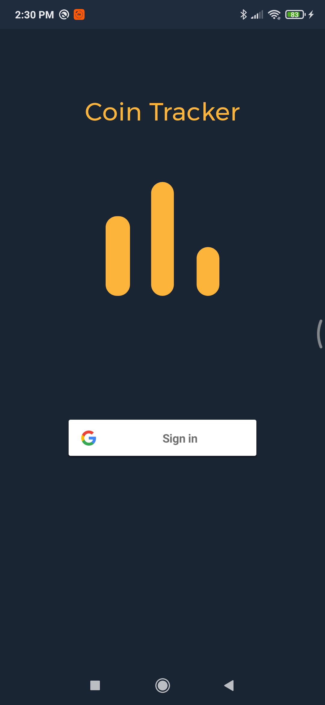
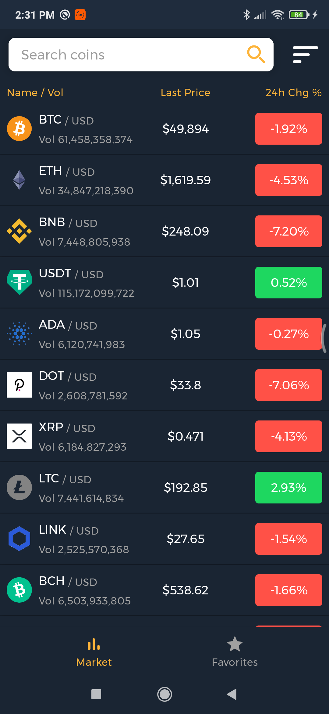

# CoinTracker

CoinTracker is a simple CryptoCurrency Price Tracker application.

    
    
    
    

Architecture components and MVVM architecture are adopted in the application.

Navigation is set using Navigation components.

Koin is used for Dependency Injection.

The data are provided by [CoinGecko](https://www.coingecko.com/en)
